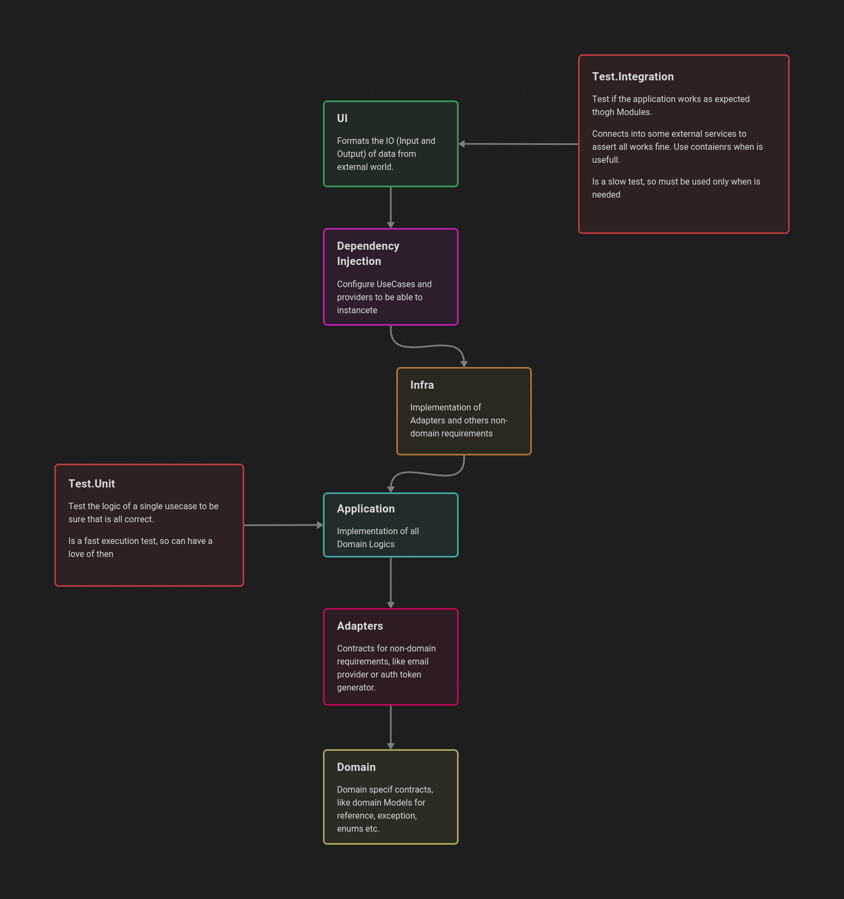

# Simple Banking


## About

This is a Picpay Backend Code challange

## Some of Knowlement used in this project

- CQRS with (MediatR)
- Commands and Events
- Unit and Integration Tests
- Modular Monolithic Application
- Domain Driven Design (DDD)
- Test Driven Development (TDD)
- Message Brokers
- Queue Consumers
- All SOLID Principles

## Starting

- Clone the repo

- Setup `.env` file. In local environment you can use the same infos at `.env.example`

    ```sh
    cp .env.example .env
    ```

- Start required services on `docker-compose`. In this project I'm using `PostgreSQL` as database and `RabbitMQ` as Message Broker

    ```sh
    docker compose up -d
    ```

- Run all tests

    ```sh
    make test/all
    ```

- If you want to run `unit` and `integration` tests individually, use use `make test/unit` or `make test/integration`

    ```sh
    make test/all
    ```

- You can also run the REST API.
    
    - Before running the application, you must run the migrations

        ```sh
        dotnet ef database update -s Src/SimpleBanking.API/
        ```

    - Now you can easily start the application

        ```sh
        make api/run
        ```

    - For development, you can run using hot reload

        ```sh
        make api/watch
        ```

## Architecture

To see more about the architecture, you can see the `README.md` file on each `Src/SimpleBanking.*` directory.

Here a representation of the architecture goals


